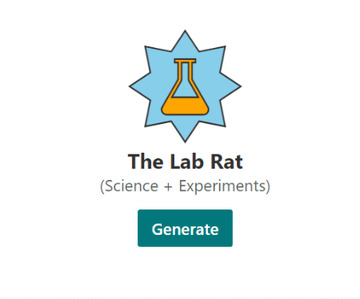

# JARBIS - START OF [LAB 12](https://github.com/SPFxHeroes/J.A.R.B.I.S.-Labs/tree/main/Lab12)

## Summary

This repository contains the J.A.R.B.I.S. webpart solution that is created in the [J.A.R.B.I.S.-Labs](https://github.com/SPFxHeroes/J.A.R.B.I.S.-Labs) and is provided as a reference solution.

Don't worry, you're in the right place. This file is pretty much it on the main branch. The individual labs are divided into branches on this repository allowing you to jump to any point in the lab. Each lab (starting with lab 3) will have a link to a specific branch in this project where all previous labs will have been implemented.

You can also jump straight there using these links:
- [Start of Lab 03](https://github.com/SPFxHeroes/JARBIS/tree/Start-of-Lab-03)
- [Start of Lab 04](https://github.com/SPFxHeroes/JARBIS/tree/Start-of-Lab-04)
- [Start of Lab 05](https://github.com/SPFxHeroes/JARBIS/tree/Start-of-Lab-05)
- [Start of Lab 06](https://github.com/SPFxHeroes/JARBIS/tree/Start-of-Lab-06)
- [Start of Lab 07](https://github.com/SPFxHeroes/JARBIS/tree/Start-of-Lab-07)
- [Start of Lab 08](https://github.com/SPFxHeroes/JARBIS/tree/Start-of-Lab-08)
- [Start of Lab 09](https://github.com/SPFxHeroes/JARBIS/tree/Start-of-Lab-09)
- [Start of Lab 10](https://github.com/SPFxHeroes/JARBIS/tree/Start-of-Lab-10)
- [Start of Lab 11](https://github.com/SPFxHeroes/JARBIS/tree/Start-of-Lab-11)
- [Start of Lab 12](https://github.com/SPFxHeroes/JARBIS/tree/Start-of-Lab-12)
- [Start of Lab 13](https://github.com/SPFxHeroes/JARBIS/tree/Start-of-Lab-13)
- [Complete](https://github.com/SPFxHeroes/JARBIS/tree/Complete)

## Used SharePoint Framework Version

## Applies to

- [SharePoint Framework](https://aka.ms/spfx)

## Disclaimer

**THIS CODE IS PROVIDED _AS IS_ WITHOUT WARRANTY OF ANY KIND, EITHER EXPRESS OR IMPLIED, INCLUDING ANY IMPLIED WARRANTIES OF FITNESS FOR A PARTICULAR PURPOSE, MERCHANTABILITY, OR NON-INFRINGEMENT.**

---

## Minimal Path to Awesome

- Clone this repository
- Switch to whatever branch matches where you want to start in the labs
- Ensure that you are at the solution folder
- in the command-line run:
  - **npm install**
  - **npm start**
- weep at the beauty

## References

- [J.A.R.B.I.S.-Labs](https://github.com/SPFxHeroes/J.A.R.B.I.S.-Labs)
